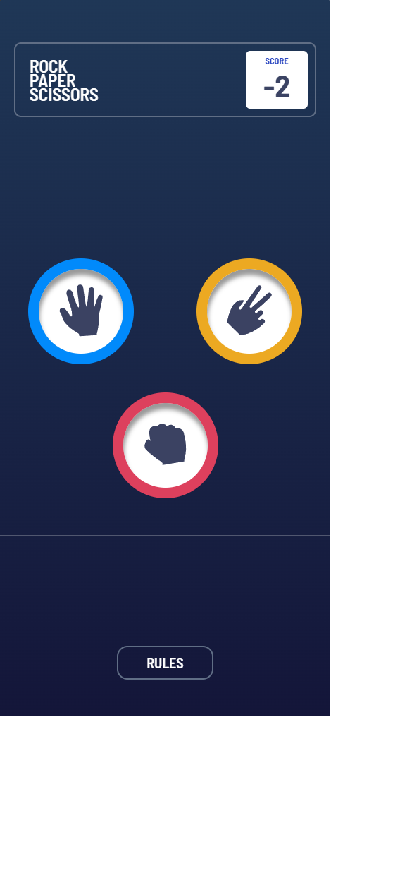
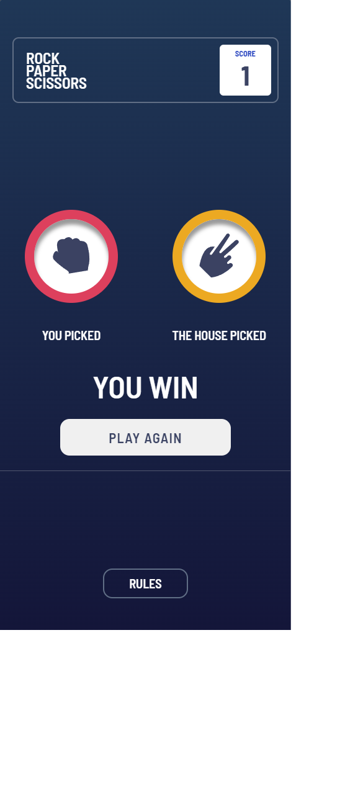

# Rock-Paper-Scissors Game

This is the classic rock-paper-scissors game, available online.

Choose your move and face your opponent in this simple but addictive game.

Live demo: [Rock-Paper-Scissors Game](https://zig94.github.io/Rock-Paper-Scissors/).

## Table of Contents

- [General Info](#general-information)
- [Technologies Used](#technologies-used)
- [Screenshots](#screenshots)
- [Project Status](#project-status)
- [Contact](#contact)

## General Information

- The player can choose from three options: stone, paper or scissors. He chooses what he thinks is the best move.

- After making a selection, the user is presented with a comparison of his choice with that of the computer, which also makes a random selection of one of the options.

- Based on the comparison of choices, the user is told whether he won, lost or tied in a round.

- The result of the round is recorded, and the user receives points for wins (+1 point) and loses points for losses (-1 point).

- The game score and player points are not reset when the page is refreshed. The game state is stored between sessions, allowing the player to continue playing from the last saved score.

## Technologies Used

- 

- 

- 

## Screenshots

## Project Status

- The goal of this project was to better understand how JavaScript works through practical application in creating an interactive game.

- I wanted to understand how to effectively manipulate elements on a page to deliver a seamless and interactive experience.

- The application is no longer being developed and was created solely for research purposes. After completing the project, I have achieved my goals.

## Contact

Created by [@Max Szymański](https://github.com/Zig94) - feel free to contact me!
